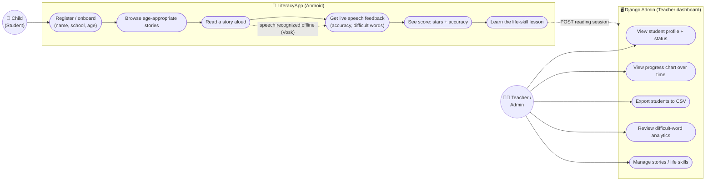

# LiteracyApp — Technical Documentation

An offline-first Android reading app that helps children (ages 5–18) practice reading aloud. The app
listens to the child read each sentence using **on-device speech recognition (Vosk)**, scores their
accuracy in real time, and pairs every story with a **life-skill lesson**. Reading sessions sync to a
**Django + PostgreSQL** backend so teachers can monitor progress.

---

## 1. Overview

| | |
|---|---|
| **Platform** | Android (min SDK 23 / target 36), pure **Kotlin + Jetpack Compose + Material 3** |
| **Architecture** | MVVM (ViewModel + `StateFlow`), Navigation-Compose |
| **Speech** | **Vosk** offline ASR (`vosk-model-small-en-us`), no network needed to recognize speech |
| **Backend** | **Django REST Framework** + **PostgreSQL**, deployed on **Railway** |
| **Repo** | Monorepo — Android in `app/`, backend in `backend/` |
| **Package** | `ayola.literacyapp.game` |

**Live API:** `https://literacyapp-production-b4fe.up.railway.app/`

---

## 2. User flow

```
Onboarding ──► Story List ──► Game (read aloud) ──► Lesson ──► back to Story List
 (name,        (age-filtered    (Vosk scores         (stars +
  school,       stories)          each sentence)       life skill)
  age group)
```

- **Onboarding** — child enters name + school and taps an age group. Registers/returns a `Student`.
- **Story List** — shows stories for the child's age group, color-coded by life skill. Back arrow → age selection.
- **Game ("Story Flow")** — one sentence at a time; the reading buddy reacts, words light up green as
  recognized, a confidence meter fills, a chime plays at ≥70%. Child taps **Next** to advance.
- **Lesson** — celebratory finish: stars (scaled to accuracy), the reading-accuracy %, and the
  story's life-skill takeaway, with confetti.

---

## 3. Use case diagram

### Actors
- **Child (Student)** — the learner using the Android app.
- **Teacher / Administrator** — monitors learners via the Django admin dashboard.
- **Backend System** — stores data and computes analytics (supporting actor).

### Mermaid (renders on GitHub)



### ASCII fallback

```
                          LITERACYAPP — USE CASES

   ┌──────────────────────────── LiteracyApp (Android) ───────────────────────────┐
   │                                                                               │
   │   ( Register / onboard )   ( Browse stories )   ( Read story aloud )          │
   │   ( Live speech feedback ) ( See stars + accuracy ) ( Learn life skill )      │
   │                                                                               │
   └───────────────────────────────────────────────────────────────────────────────┘
        ▲                                                            │
        │ uses                                          POST session │
   ┌─────────┐                                                       ▼
   │  Child  │                                          ┌────────────────────────┐
   │(Student)│                                          │   Backend (Django) +   │
   └─────────┘                                          │   PostgreSQL (Railway) │
                                                        └────────────────────────┘
        ┌───────────┐                                              ▲
        │  Teacher  │  uses                                        │ reads
        │  / Admin  │──────────────────────────────────────────────┘
        └───────────┘
              │   ┌──────────────────── Django Admin dashboard ───────────────────┐
              └──►│ (View profile + status) (Progress chart) (Export CSV)         │
                  │ (Difficult-word analytics) (Manage stories / life skills)     │
                  └────────────────────────────────────────────────────────────────┘
```

---

## 4. Architecture & project structure

### Android (`app/src/main/java/ayola/literacyapp/game/`)

```
api/
  LiteracyApiService.kt   Retrofit interface (students, stories, sessions)
  RetrofitClient.kt       singleton Retrofit (base URL, OkHttp logging)
models/
  Student.kt, Story.kt, SessionRequest.kt
  Story.getSentences()    parses content (stringified JSON array) -> List<String>
utils/
  SessionManager.kt           SharedPreferences: student_id, age_group; ANDROID_ID as device_id
  SpeechRecognizerManager.kt  Vosk wrapper (unpack model, listen, emit results as StateFlow)
  ErrorMessages.kt            maps exceptions/HTTP codes -> friendly text + logs the real cause
ui/
  onboarding/   OnboardingScreen + OnboardingViewModel
  storylist/    StoryListScreen + StoryListViewModel
  game/         GameScreen + GameViewModel + ReadingBuddy (avatar + ding)
  lesson/       LessonScreen + LessonViewModel + ConfettiBurst
  navigation/   AppNavigation (NavHost + routes)
  theme/        Color, Theme, Type, SkillVisuals
MainActivity.kt  hosts AppNavigation() inside LiteracyAppTheme
```

**Pattern:** each screen has a `ViewModel` exposing a single immutable UI-state `data class` via
`StateFlow`; Composables `collectAsState()` and render. ViewModels are created with small
`ViewModelProvider.Factory`s that inject `SessionManager` / `SpeechRecognizerManager` (no DI framework).

**Navigation routes:** `onboarding` → `story_list` → `game/{storyId}` → `lesson/{storyId}/{accuracy}`.
Onboarding stays on the back stack so the child can return to age selection from the story list.

### Backend (`backend/`)

```
backend/        Django project (settings, urls, wsgi)
api/
  models.py     Teacher, Student, Story, Session
  serializers.py, views.py, urls.py
  admin.py      StudentAdmin profile card + SVG progress chart; CSV export; difficult-word analytics
  analytics.py  aggregate_difficult_words, csv_response
  fixtures/stories.json   seed stories (loaded on deploy)
Procfile        migrate -> loaddata stories -> gunicorn
requirements.txt
```

---

## 5. Data model & API

### Models (Django)
- **Student** — `name, school, age_group, device_id` (+ timestamps). Unique per `(name, device_id)` so
  one tablet hosts many child profiles.
- **Story** — `title, age_group, content, life_skill, life_skill_lesson, difficulty_level`.
  `content` is a JSON-encoded array of sentence strings.
- **Session** — `student (FK), story (FK), duration_seconds, accuracy_percent, difficult_words (JSON)`.
- **Teacher** — `name, email, school, password (hashed), auth_token` (admin/monitoring).

### REST endpoints
| Method | Path | Body | Returns |
|---|---|---|---|
| POST | `/api/students/` | `name, device_id, school, age_group` | `Student` (201 new / 200 returning) |
| GET | `/api/stories/` | `?age_group=` (optional) | `[Story]` |
| POST | `/api/sessions/` | `student, story, duration_seconds, accuracy_percent, difficult_words` | created `Session` |

JSON keys are snake_case; the Android models map them via Gson `@SerializedName`.

---

## 6. Speech recognition & scoring (Vosk)

- **Model:** `vosk-model-small-en-us` bundled in `assets/model/` (NOT in git — see Setup). Requires a
  `uuid` file or `StorageService.unpack` hangs silently.
- **`SpeechRecognizerManager`** unpacks the model to the app's files dir, runs a `Recognizer` +
  `SpeechService`, and publishes `SpeechState(isReady, isListening, partialText, resultText, error)`.
- **Listening window** (in `GameViewModel`): tapping the mic opens a window =
  `6s + 1.5s × wordCount` (capped 30s), recomputed per sentence so longer lines get more time. Recognized
  segments **accumulate** across the window, so pausing mid-sentence doesn't erase earlier words.
- **Scoring:** `accuracy = matchedExpectedWords / totalExpectedWords` (case-insensitive, punctuation
  stripped). `difficult_words` = expected words never recognized. Session average is the rounded mean of
  per-sentence accuracy; posted to `/api/sessions/`.

---

## 7. Gamification & UX

- **Reading buddy** — an age-mapped character beside the sentence that reacts: 😄 ≥70%, 🤔 struggling,
  👂 listening, 🙂 idle. Renders real art (`<character>_<expression>.png`); bobs and pops with progress.
- **Characters by age group:** 5-7 **Kofi** · 8-10 **Ama** · 11-13 **Yaw** · 14-15 **Esi** · 16-18 **Musa**.
- **Live word highlighting** — expected words turn green as they're recognized.
- **Confidence meter** — green/amber/red gradient with a 70% pass marker.
- **Success chime** — plays once when confidence first crosses 70% (system tone, no asset).
- **Lesson screen** — stars (3 ≥80% / 2 ≥50% / 1 for finishing), reading-accuracy %, confetti, and the
  life-skill takeaway, color-coded by skill.
- **Theme** — playful "Let's Read" palette (sunny orange + teal + cream), large rounded type.

---

## 8. Error handling

`utils/ErrorMessages.kt` centralizes user-facing messages and logging:
- `UnknownHostException` → "No internet connection. Please check your Wi-Fi or mobile data and try again."
- timeout / connect / SSL / generic IO → tailored friendly text.
- HTTP 5xx → "Our server is having a problem…", 4xx → "Please check the details…".
- The real exception is always logged (`Log.e`, tag **`LiteracyApp`**) for debugging.

---

## 9. Teacher dashboard (Django admin)

`/admin/` (Django admin) provides, per student:
- A **profile card** — avatar initial, details, session count, average accuracy, last-read date, and a
  status badge (🌟 High Performer / ⚠️ Needs Support / 🔥 Regular Learner / 👍 On Track / 🆕 First Time).
- A **progress chart** — server-rendered inline SVG of accuracy per session over time (no JS/CDN).
- **CSV export** of students and **difficult-word analytics** across sessions.

---

## 10. Setup, build & run

### Vosk model (required, not in git)
1. Download `vosk-model-small-en-us` from https://alphacephei.com/vosk/models
2. Unzip its **contents** into `app/src/main/assets/model/`
3. Create a file `app/src/main/assets/model/uuid` containing any short string (e.g. `v1`)
   — without it, `StorageService.unpack` fails silently and the app hangs on "Loading Speech Engine…".

### Android
```bash
./gradlew assembleDebug     # build debug APK -> app/build/outputs/apk/debug/app-debug.apk
./gradlew installDebug      # install to a connected device/emulator
```
Grant the microphone permission when prompted. The app talks to the live Railway URL over HTTPS by
default (`api/RetrofitClient.kt`); for local backend testing use `http://10.0.2.2:8001/`.

### Backend (local)
```bash
cd backend
python -m venv venv && venv/bin/pip install -r requirements.txt
venv/bin/python manage.py migrate
venv/bin/python manage.py loaddata stories
venv/bin/python manage.py runserver 0.0.0.0:8001
```

### Deployment (Railway)
- Deploy the repo with **Root Directory = `backend`**; add a **PostgreSQL** service (auto-injects
  `DATABASE_URL`). The `Procfile` runs `migrate` → `loaddata stories` → `gunicorn`.
- Set `DEBUG=False` and a real `SECRET_KEY` in env for production. `ALLOWED_HOSTS` already covers
  `*.railway.app`. Pushing to the connected branch auto-deploys.

---

## 11. Notes & known constraints

- Debug APK is large (~115 MB): the Vosk model (~68 MB) + `libvosk.so` across 4 ABIs (~36 MB). Can be
  trimmed via `abiFilters` (arm64-v8a) or by downloading the model at runtime.
- Speech accuracy is best on a physical device; the emulator's virtual mic is unreliable for ASR.
- A running `PROGRESS_LOG.md` documents the full build history, decisions, and fixes.
