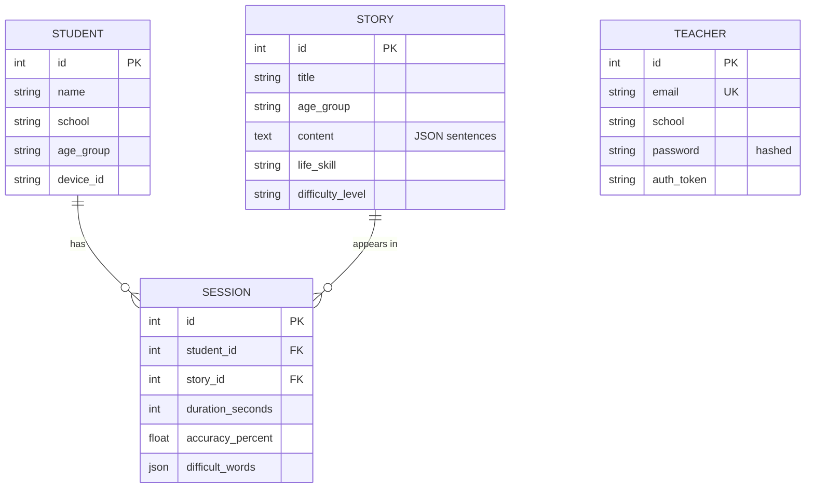
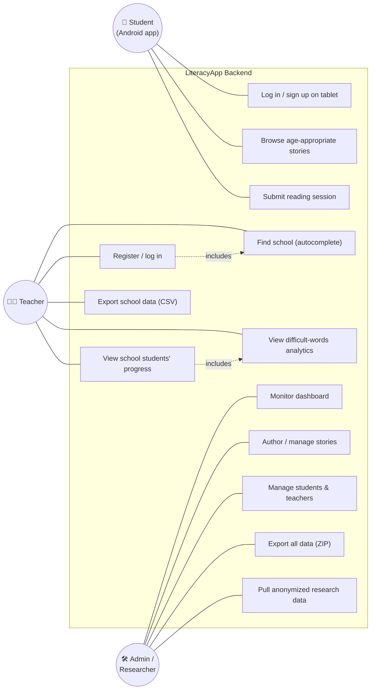
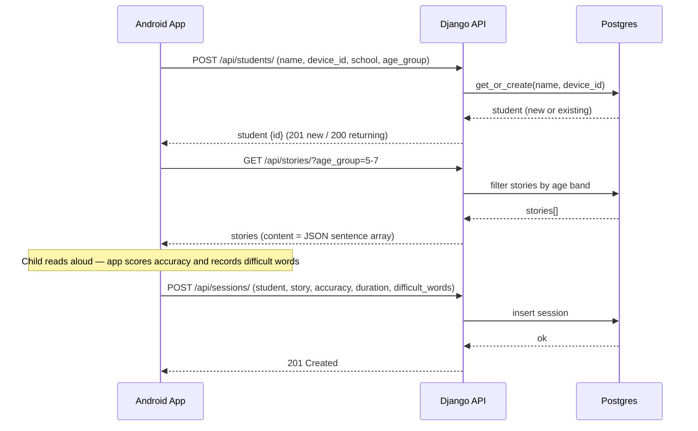
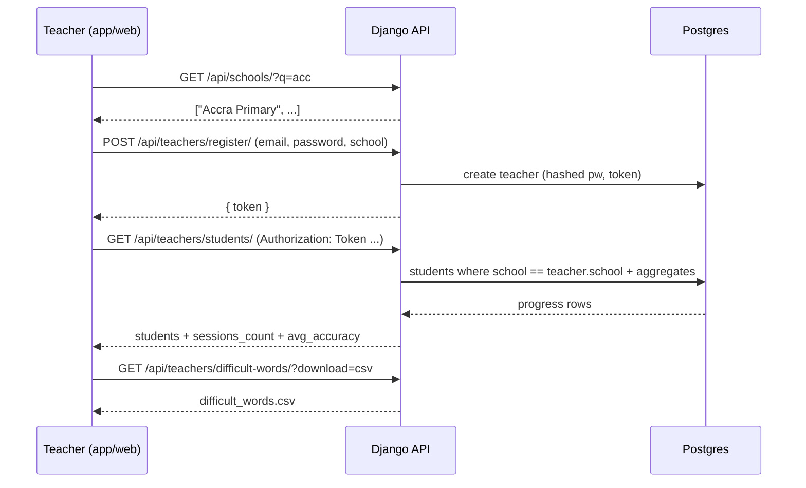

# LiteracyApp — Backend Service Report

**Service:** `literacyapp` (Django REST backend)
**Live URL:** https://literacyapp-production-b4fe.up.railway.app
**Repo path:** `lerryellis/literacyapp` → `/backend` (Railway root directory)
**Last reviewed:** 2026-06-18

---

## 1. Purpose

The backend powers an offline-first Android literacy game in which children read
short, life-skill stories aloud. It:

1. Onboards/identifies **students** on shared school tablets.
2. Serves age-appropriate **stories** (life-skill lessons).
3. Records each reading **session** — accuracy, duration, and the words the
   child struggled with.
4. Gives **teachers** a school-scoped view of their students' progress.
5. Provides **admins/researchers** a monitoring dashboard and full data export.

---

## 2. Architecture & Tech Stack

| Layer | Technology |
|---|---|
| Framework | Django 4.2 (LTS) + Django REST Framework 3.16 |
| Admin UI | Django Admin themed with Jazzmin 3.0 |
| Database | PostgreSQL (Railway), via `dj-database-url`; SQLite fallback locally |
| Static files | WhiteNoise (compressed manifest storage) |
| Server | Gunicorn |
| CORS | `django-cors-headers` (all origins, dev) |
| Hosting | Railway (Hobby plan), auto-deploy from `main` |
| Runtime | Python 3.13 (Railway) / 3.9 (local dev) |

**Deploy command (Procfile):**
```
web: python manage.py migrate && (python manage.py loaddata stories || true) && gunicorn backend.wsgi --bind 0.0.0.0:$PORT
```
Migrations and story seeding run automatically on every deploy. `DATABASE_URL`
is wired to the Railway Postgres service; a persistent volume keeps data across
redeploys.

---

## 3. Data Models

### Student — *the app's registered users*
| Field | Type | Notes |
|---|---|---|
| name | CharField | |
| school | CharField | links teachers to students |
| age_group | CharField | e.g. `5-7` |
| device_id | CharField | tablet identifier |
| created_at / updated_at | DateTime | |
| **Constraint** | UniqueConstraint(name, device_id) | one tablet hosts many named profiles |

### Story
| Field | Type | Notes |
|---|---|---|
| title | CharField | |
| age_group | CharField | filterable via `?age_group=` |
| content | TextField | **JSON-stringified array of sentences** |
| life_skill | CharField | |
| life_skill_lesson | TextField | |
| difficulty_level | CharField | Beginner / Intermediate / Advanced |

### Session — *the collected reading data*
| Field | Type | Notes |
|---|---|---|
| student | FK → Student | `related_name="sessions"` |
| story | FK → Story | `related_name="sessions"` |
| duration_seconds | IntegerField | |
| accuracy_percent | FloatField | |
| difficult_words | JSONField | list of words the child struggled with |
| created_at | DateTime | |

### Teacher — *self-service accounts*
| Field | Type | Notes |
|---|---|---|
| name | CharField | optional |
| email | EmailField | unique |
| school | CharField | scopes which students they can see |
| password | CharField | **hashed** (Django hashers) |
| auth_token | CharField | issued at register/login |

### 3.1 Entity-Relationship Diagram



> **Note:** `TEACHER` and `STUDENT` are linked by matching `school` *string*
> (no foreign key / `School` table). A teacher sees students where
> `student.school == teacher.school`.

---

## 4. API Surface

### App endpoints (used by the Android client)
| Method | Path | Purpose |
|---|---|---|
| POST | `/api/students/` | Login-or-signup: get-or-create by (name, device_id). 201 new / 200 returning |
| GET | `/api/stories/` `?age_group=` | List stories, optionally filtered by age band |
| POST | `/api/sessions/` | Save a reading session (scores + difficult words) |
| (CRUD) | `/api/students/`, `/api/stories/`, `/api/sessions/` | Standard DRF viewsets |

### Teacher endpoints (token-authed, school-scoped)
| Method | Path | Purpose |
|---|---|---|
| POST | `/api/teachers/register/` | Self-signup (email + password + school) → token |
| POST | `/api/teachers/login/` | → token |
| GET | `/api/schools/?q=` | School-name autocomplete (existing schools) |
| GET | `/api/teachers/students/` | Students in their school + progress (`?download=csv`) |
| GET | `/api/teachers/difficult-words/` | Difficult words ranked for their school (`?download=csv`) |
| GET | `/api/teachers/sessions/` | Raw session rows for their school (`?download=csv`) |

### Research / admin endpoints (admin-only: session or basic auth, `IsAdminUser`)
| Method | Path | Purpose |
|---|---|---|
| GET | `/api/research/difficult-words/` | Difficult words across **all** schools |
| GET | `/api/research/sessions/` | **Anonymized** session rows (learner_ref hash, no names/devices) |
| GET | `/api/research/export-all/` | **ZIP of CSVs**: students, sessions, stories, teachers, difficult-words |

> Note: export endpoints use `?download=csv` — *not* `?format=`, which collides
> with DRF content negotiation and 404s.

---

## 5. Authentication Model

- **Students:** no auth — identified by (name + device_id). Login = get-or-create.
- **Teachers:** email + password (hashed); a random `auth_token` is issued and
  sent as `Authorization: Token <token>`. Each teacher only ever sees their own
  school's data.
- **Admin / research:** Django staff/superuser via session (browser) or basic
  auth (`IsAdminUser`). Cross-school and full-export endpoints are admin-only.

---

## 6. Admin Dashboard (Jazzmin)

- **Dashboard index:** live stat cards (students, sessions, avg accuracy,
  stories/teachers), recent-sessions table, top students, most-difficult-words,
  and an **Export all data (ZIP)** button.
- **Students:** list with session count / avg accuracy / status badge; detail
  page shows a **profile card** + **SVG progress-over-time chart**; CSV export.
- **Stories:** authoring form (one sentence per line → JSON), dropdowns for age
  group / life skill / difficulty; word & sentence counts; CSV export.
- **Sessions:** performance badges, difficult-word chips, CSV export + a
  difficult-words report action.
- **Teachers:** read-only credentials, students-in-school count, CSV export.

---

## 7. Data Export & Mining

All collected data is exportable to CSV:
- Per-school (teachers): students, sessions, difficult-words.
- Cross-school anonymized (research): sessions, difficult-words.
- Full database (admin): a single ZIP of per-table CSVs.
Difficult-word aggregation is case-normalized and counts both total
occurrences and distinct affected students.

---

## 8. Actors & Use Cases

| Actor | Goals |
|---|---|
| **Student** (Android app) | Log in on a shared tablet; fetch age-appropriate stories; submit reading sessions |
| **Teacher** (app/web) | Register/login; pick their school (autocomplete); view their students' progress and difficult words; export their school's data |
| **Admin / Researcher** | Monitor the dashboard; manage stories/students/teachers; author stories; export all data; pull anonymized cross-school research data |
| **System (Railway)** | Auto-migrate & seed on deploy |

### Use Case Diagram (Mermaid)



### Sequence Diagram — Student reading flow



### Sequence Diagram — Teacher dashboard flow



### Use Case Diagram (ASCII fallback)

```
                          LITERACYAPP BACKEND
        +-----------------------------------------------------------+
        |                                                           |
 Student|--( Log in / sign up on shared tablet )                    |
  (app) |--( Browse age-appropriate stories )                       |
        |--( Submit reading session: accuracy, duration, words )    |
        |                                                           |
 Teacher|--( Register / log in )                                    |
        |--( Find school via autocomplete )                         |
        |--( View their school's students' progress )               |
        |--( View difficult-words analytics )                       |
        |--( Export school data to CSV )                            |
        |                                                           |
 Admin /|--( Monitor live dashboard )                               |
Research|--( Author & manage stories )                              |
        |--( Manage students & teachers )                           |
        |--( Export ALL data as ZIP of CSVs )                       |
        |--( Pull anonymized cross-school research data )           |
        +-----------------------------------------------------------+
```

---

## 9. Security & Operational Notes

- ✅ Teacher passwords hashed; tokens/hashes never exported.
- ✅ Cross-school & full-export endpoints gated by `IsAdminUser`.
- ✅ `ALLOWED_HOSTS` scoped to local + `*.railway.app`; `DEBUG`/`SECRET_KEY` from env.
- ⚠️ `CORS_ALLOW_ALL_ORIGINS = True` — fine for dev; tighten for production.
- ⚠️ Demo superuser uses a weak password — rotate before real use.
- ⚠️ Teacher token auth is bearer-style without expiry/rotation; adequate for
  the demo, revisit for production.
- ⚠️ `export-all` builds the ZIP in memory — move to streaming/background at scale.
- ⚠️ Difficult-words analytics include common stopwords; add a stopword filter
  for cleaner research output.

---

## 10. Status

Live and verified: API, teacher accounts, school-scoped progress, dashboard,
profile card + progress chart, and all CSV/ZIP exports are deployed and working
against the Railway Postgres database.
